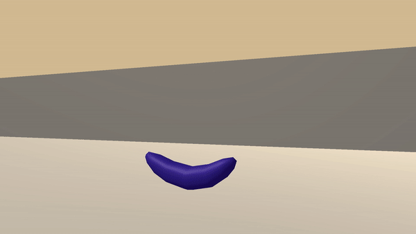

# Collect Bananas DeepQN Project

================================================================================

This project is part of Udacity Deep Reinforcement Learning Nanodegree, which is a four-month course that I am enrolled in. The purpose of this project is to train an agent how to navigate a huge square environment gathering as many yellow bananas as possible while avoiding blue bananas.




## Install


### Clone the repo

```
git clone https://github.com/idrisso4/Collect-Bananas-DeepQN

cd Collect-Bananas-DeepQN
```

### Create conda Environment

```
conda env create -f environment.yaml

source activate deeprlnd
```

### Download the Unity Environment

- Linux: [click here](https://s3-us-west-1.amazonaws.com/udacity-drlnd/P1/Banana/Banana_Linux.zip)
- Mac OSX: [click here](https://s3-us-west-1.amazonaws.com/udacity-drlnd/P1/Banana/Banana.app.zip)
- Windows (32-bit): [click here](https://s3-us-west-1.amazonaws.com/udacity-drlnd/P1/Banana/Banana_Windows_x86.zip)
- Windows (64-bit): [click here](https://s3-us-west-1.amazonaws.com/udacity-drlnd/P1/Banana/Banana_Windows_x86_64.zip)

## Config

Change the parameters in the config.yaml folder

## Train the Agent:

```
python main.py --train
```

## Evaluate the agent:

```
python main.py --eval
```